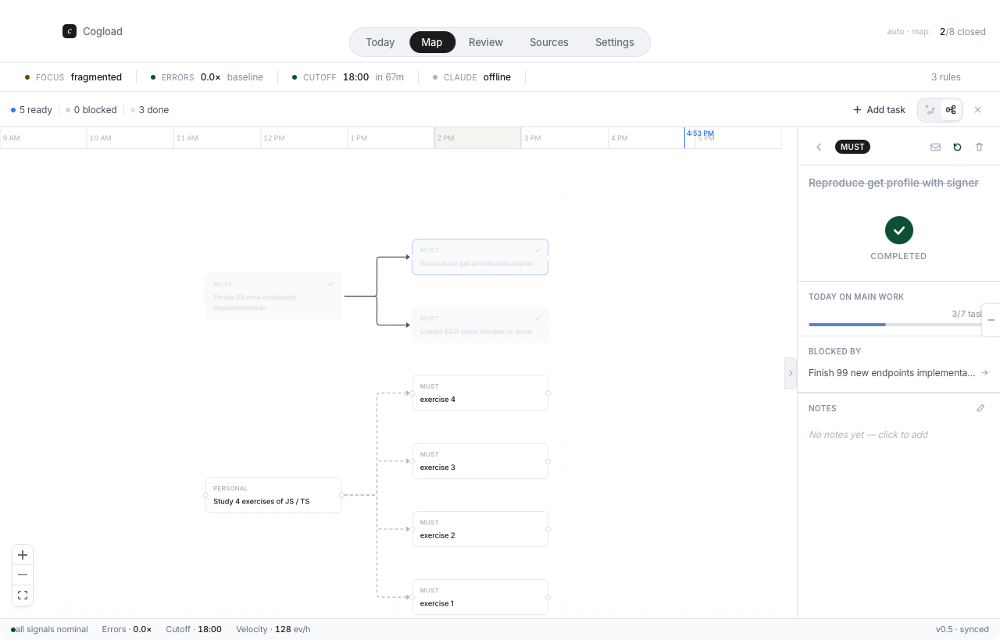

# Cogload

<p align="center">
  
</p>

A native macOS app that tracks your cognitive load and intervenes before you burn out.

**Stack:** Tauri 2 (Rust) · React + TypeScript · Go backend · SQLite

## Setup & Install (local machine)

Get Cogload running on your Mac from a clean checkout.

### 1. Install prerequisites

| Tool | Why | Install |
| --- | --- | --- |
| **Rust** (stable) | Tauri shell | `curl --proto '=https' --tlsv1.2 -sSf https://sh.rustup.rs \| sh` |
| **Node.js** 18+ | Frontend & Tauri CLI | `brew install node` |
| **Go** 1.23+ | Backend sidecar | `brew install go` |
| **Xcode CLT** | macOS build toolchain | `xcode-select --install` |

Verify everything is on your `PATH`:

```bash
rustc --version && node --version && go version
```

### 2. Clone the repo

```bash
git clone https://github.com/cogload/cognitive-offload.git
cd cognitive-offload
```

### 3. Install frontend dependencies

```bash
cd frontend
npm install
```

### 4. Run in development

```bash
npm run tauri dev
```

The Go backend is compiled into a [Tauri sidecar](https://v2.tauri.app/develop/sidecar/) (via `scripts/build-backend-sidecar.sh`, run automatically), spawned when the app launches, and killed on quit. It listens on `http://127.0.0.1:9200`.

### 5. Build & install the app

```bash
npm run tauri build
cp -R src-tauri/target/release/bundle/macos/Cogload.app /Applications/
xattr -dr com.apple.quarantine /Applications/Cogload.app
```

`Cogload.app` ships with the backend bundled inside — no separate daemon to start. Launch it from `/Applications` or Spotlight.

---

## Manual setup

The commands below are the underlying steps if you'd rather run them directly.

## Run

```bash
cd frontend && npm install && npm run tauri dev
```

The Go backend is bundled as a [Tauri sidecar](https://v2.tauri.app/develop/sidecar/) — it's built automatically and spawned when the app launches, killed on quit. Backend listens on `http://127.0.0.1:9200`.

## Install

```bash
cd frontend && npm run tauri build
cp -R src-tauri/target/release/bundle/macos/Cogload.app /Applications/
xattr -dr com.apple.quarantine /Applications/Cogload.app
```

The `.app` ships with the backend inside it — no separate daemon to start.

## Modes

- **Today** — tasks, bandwidth, active thread
- **Map** — task graph with dependencies and timeline
- **Review** — daily audit, patterns, energy map
- **Sources** — inputs and integrations
- **Settings** — preferences

## License

MIT
